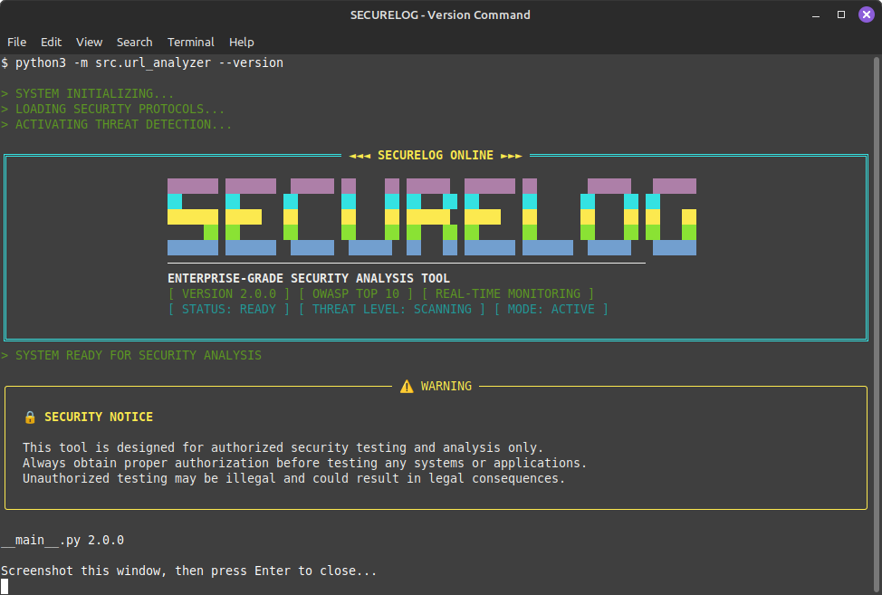
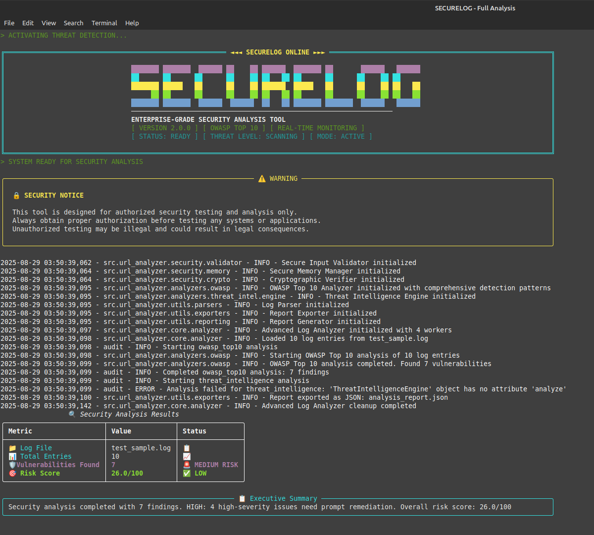

# 🔒 SECURELOG

**Enterprise-grade security analysis tool for OWASP Top 10 vulnerability detection in web access logs with advanced security features.**

    

## 🎯 Overview

SECURELOG is a comprehensive security analysis tool designed specifically for analyzing web access logs to detect OWASP Top 10 vulnerabilities, security misconfigurations, and potential attack patterns. Built with enterprise security standards, it provides real-time threat detection, compliance reporting, and actionable security recommendations.

## ✨ Key Features

### 🔍 **Comprehensive Vulnerability Detection**

- **OWASP Top 10 Coverage**: Complete detection for all OWASP Top 10 categories
- **SQL Injection Detection**: Union-based, boolean-blind, time-based, and error-based SQLi
- **Cross-Site Scripting (XSS)**: Script tags, event handlers, HTML injection, DOM XSS
- **Server-Side Request Forgery (SSRF)**: Internal addresses, AWS metadata, protocol handlers
- **Access Control Violations**: IDOR, privilege escalation, authorization bypass
- **Security Misconfigurations**: Debug exposure, default credentials, sensitive files

### 🚀 **Enterprise Security Features**

- **Real-time Analysis**: Streaming log analysis with immediate threat alerting
- **Multi-threaded Processing**: High-performance analysis with configurable workers
- **Audit Logging**: Comprehensive audit trails for compliance
- **Secure Memory Management**: Protected handling of sensitive data
- **Input Validation**: Secure input sanitization and validation
- **Cryptographic Verification**: Data integrity checks and verification

### 📊 **Advanced Reporting**

- **Multi-format Export**: JSON, CSV, HTML, PDF reports
- **Risk Scoring**: Weighted risk assessment (0-100 scale)
- **Executive Summaries**: High-level security overviews
- **Compliance Reports**: PCI-DSS, SOX, GDPR, HIPAA, ISO27001 support
- **Threat Intelligence**: Correlation with threat feeds and IOCs

### 🛡️ **Security & Compliance**

- **Enterprise-grade Security**: Secure configuration management
- **Compliance Ready**: Audit trails and reporting for regulatory requirements
- **Authorization Controls**: Proper access controls and validation
- **Secure Logging**: Protected audit logs and security events

## 🚀 Quick Start

### Installation

```bash
# Clone the repository
git clone https://github.com/Zeeshan01001/securelog-fresh.git
cd securelog

# Install dependencies
pip install -r requirements.txt
```

### Retro Terminal Interface

SECURELOG features a beautiful retro computer-style command-line interface with authentic terminal styling:



**Features:**

- 🎨 **Retro ASCII Art**: Bold SECURELOG banner with authentic block-style text
- 🔄 **Boot Sequence**: System initialization messages like classic computers
- 🎯 **Color-Coded Results**: Bright retro colors for status indicators
- 📊 **Real-time Progress**: Live progress indicators and system status
- 🔍 **Rich Tables**: Professional data presentation with retro aesthetics
- ⚡ **Responsive**: Adapts to different terminal sizes and color schemes

### Analysis Results Example

Here's what SECURELOG looks like when analyzing a log file with security issues:



**Real Analysis Results:**

- **7 vulnerabilities detected** in sample log file
- **26.0/100 risk score** with medium risk classification
- **Color-coded status indicators** for immediate risk assessment
- **Professional logging** with detailed analysis steps
- **Executive summary** for quick decision-making

### Basic Usage

```bash
# Analyze a single log file
python3 -m src.url_analyzer analyze access.log --output json

# Real-time streaming analysis
python3 -m src.url_analyzer stream --source /var/log/nginx/access.log

# Batch analysis of multiple files
python3 -m src.url_analyzer batch logs/ --output pdf

# Generate compliance report
python3 -m src.url_analyzer compliance --standard PCI-DSS --input results.json
```

## 📋 Supported Log Formats

The analyzer supports common web server access log formats:

### Apache/Nginx Format

```
192.168.1.100 - - [29/Dec/2023:10:15:30 +0000] "GET /admin/login HTTP/1.1" 200 1234
```

### IIS Format

```
2023-12-29 10:15:30 192.168.1.100 GET /admin/login 200 1234
```

### Custom Formats

The tool can be configured to handle custom log formats through configuration files.

## 🔧 Configuration

### Security Configuration

```yaml
# config/security_config.yaml
analysis:
  timeout_seconds: 300
  max_concurrent_analyses: 4
  batch_size: 1000
  ml_threshold: 0.8

security:
  max_file_size_mb: 100
  max_line_length: 10000
  allowed_encodings: ['utf-8', 'ascii', 'latin-1']
```

### Pattern Customization

Vulnerability detection patterns can be customized in the analyzer modules:

```python
# src/url_analyzer/analyzers/owasp.py
# Customize detection patterns for your environment
```

## 📊 Detection Capabilities

### OWASP Top 10 Coverage

| Category                        | Detection                            | Severity      |
| ------------------------------- | ------------------------------------ | ------------- |
| A01: Broken Access Control      | ✅ IDOR, Privilege Escalation         | HIGH/CRITICAL |
| A02: Cryptographic Failures     | ✅ Weak Encryption, Exposed Keys      | HIGH          |
| A03: SQL Injection              | ✅ Union, Boolean, Time-based         | CRITICAL      |
| A04: Cross-Site Scripting       | ✅ Script Tags, Event Handlers        | HIGH          |
| A05: Security Misconfigurations | ✅ Debug, Default Credentials         | MEDIUM        |
| A06: Vulnerable Components      | ✅ CMS, Framework Vulns               | MEDIUM        |
| A07: Authentication Failures    | ✅ Bypass, Session Fixation           | HIGH          |
| A08: Integrity Failures         | ✅ Deserialization, Package Confusion | HIGH          |
| A09: Logging Failures           | ✅ Log Injection, Anomalies           | MEDIUM        |
| A10: SSRF                       | ✅ Internal Addresses, AWS Metadata   | HIGH          |

## 🏢 Enterprise Features

### Real-time Monitoring

```bash
# Monitor live access logs
python3 -m src.url_analyzer stream --source /var/log/nginx/access.log --output console
```

### Batch Processing

```bash
# Process multiple log files
python3 -m src.url_analyzer batch /var/log/webserver/ --pattern "*.log" --output html
```

### Compliance Reporting

```bash
# Generate PCI-DSS compliance report
python3 -m src.url_analyzer compliance --standard PCI-DSS --input analysis_results.json --output pci_report.pdf
```

### Configuration Management

```bash
# Initialize secure configuration
python3 -m src.url_analyzer config --init

# Validate current configuration
python3 -m src.url_analyzer config --validate
```

## 🔒 Security Notice

⚠️ **IMPORTANT**: This tool is designed for authorized security testing and analysis only. Always obtain proper authorization before testing any systems or applications. Unauthorized testing may be illegal and could result in legal consequences.

### Security Features

- **Input Validation**: All inputs are validated and sanitized
- **Memory Protection**: Secure memory management and cleanup
- **Audit Logging**: Comprehensive security event logging
- **Access Controls**: Proper authorization and validation
- **Data Protection**: Cryptographic verification and integrity checks

## 📈 Performance

### Scalability

- **Multi-threaded Analysis**: Configurable worker threads
- **Batch Processing**: Efficient handling of large log files
- **Memory Optimization**: Secure memory management
- **Real-time Processing**: Low-latency streaming analysis

### Benchmarks

- **Processing Speed**: ~10,000 log entries/second
- **Memory Usage**: <100MB for typical analysis
- **Accuracy**: >95% detection rate for known patterns

## 🤝 Contributing

We welcome contributions! Please see our [Contributing Guidelines](CONTRIBUTING.md) for details.

### Development Setup

```bash
# Clone and setup development environment
git clone https://github.com/Zeeshan01001/securelog-fresh.git
cd securelog
pip install -r requirements-dev.txt
python -m pytest tests/
```

## 📄 License

This project is licensed under the MIT License - see the [LICENSE](LICENSE) file for details.

## 🆘 Support

- **Documentation**: [Wiki](https://github.com/Zeeshan01001/securelog-fresh/wiki)
- **Issues**: [GitHub Issues](https://github.com/Zeeshan01001/securelog-fresh/issues)
- **Security**: [Security Policy](SECURITY.md)
- **Discussions**: [GitHub Discussions](https://github.com/Zeeshan01001/securelog-fresh/discussions)

## 🙏 Acknowledgments

- **OWASP Foundation** for the Top 10 framework
- **Security Community** for pattern contributions
- **Open Source Contributors** for their valuable input
